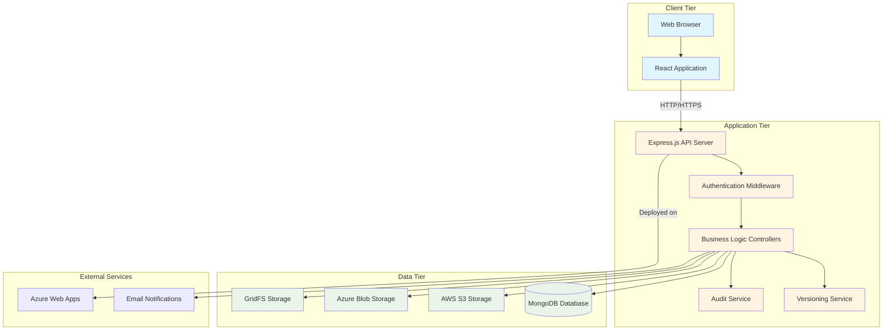
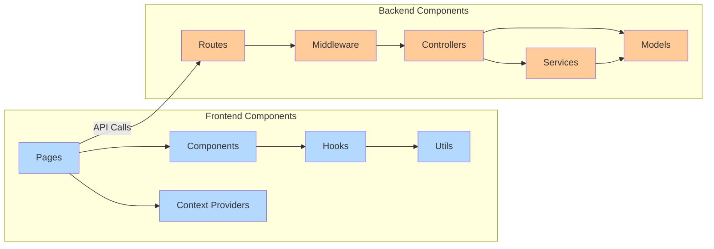
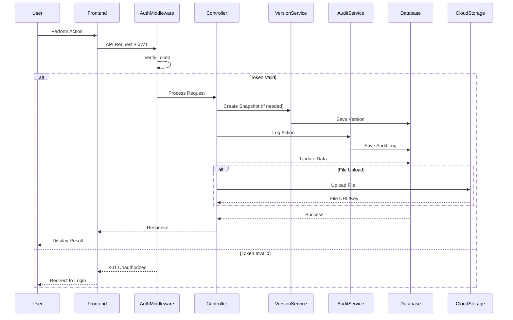
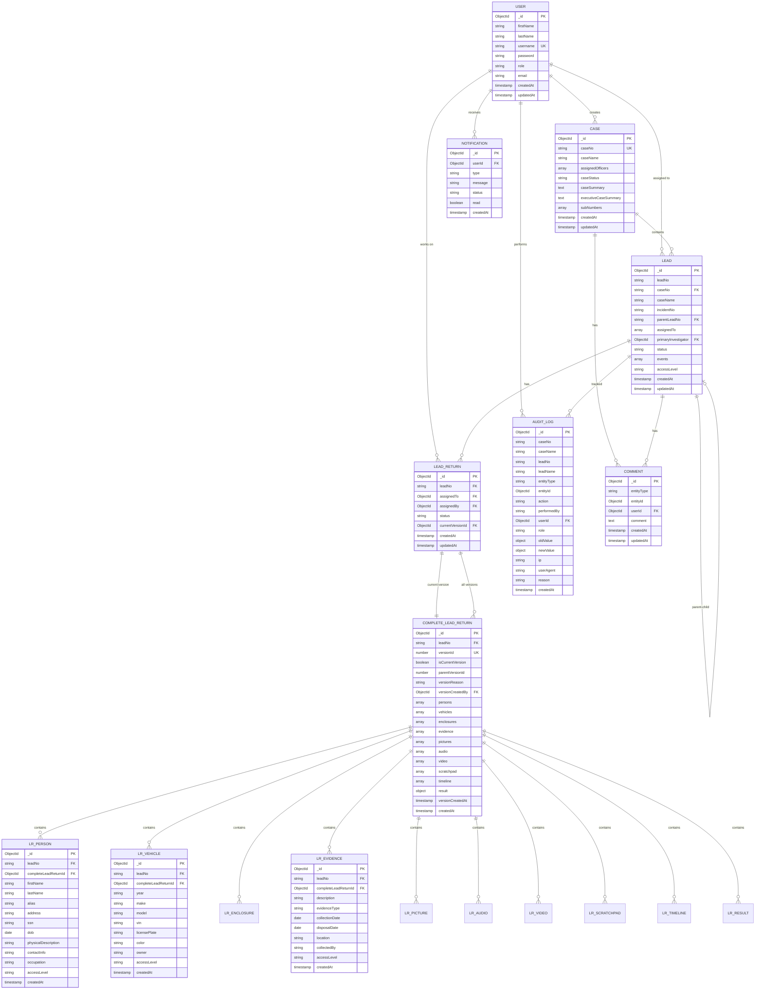

# Software Requirements Documentation (SRD)
## PIMS - Police Investigation Management System

**Version:** 1.0
**Date:** January 20, 2026
**Prepared By:** Development Team
**Status:** Current

---

## Table of Contents

1. [Introduction](#1-introduction)
2. [System Overview](#2-system-overview)
3. [Functional Requirements](#3-functional-requirements)
4. [Non-Functional Requirements](#4-non-functional-requirements)
5. [System Architecture](#5-system-architecture)
6. [Database Design](#6-database-design)
7. [API Specifications](#7-api-specifications)
8. [Workflow Diagrams](#8-workflow-diagrams)
9. [User Roles and Permissions](#9-user-roles-and-permissions)
10. [Security Requirements](#10-security-requirements)
11. [Deployment Architecture](#11-deployment-architecture)
12. [Appendices](#12-appendices)

---

## 1. Introduction

### 1.1 Purpose
This Software Requirements Documentation (SRD) defines the functional and non-functional requirements for the Police Investigation Management System (PIMS). The document serves as a comprehensive guide for developers, stakeholders, and system administrators.

### 1.2 Scope
PIMS is a web-based investigation management platform designed to streamline police investigation workflows, including case creation, lead assignment, investigation documentation, evidence tracking, and comprehensive audit trails.

### 1.3 Target Audience
- Police Investigators
- Case Managers
- Detective Supervisors
- Administrative Personnel
- System Administrators

### 1.4 Document Conventions
- **Must**: Mandatory requirement
- **Should**: Recommended requirement
- **May**: Optional requirement

---

## 2. System Overview

### 2.1 System Description
PIMS is a full-stack web application that provides end-to-end investigation management capabilities. The system enables law enforcement personnel to:
- Create and manage investigation cases
- Assign and track investigation leads
- Document investigation findings with 11 comprehensive sections
- Maintain complete version history and audit trails
- Collaborate through comments and notifications
- Generate professional reports and chain of custody documentation

### 2.2 Technology Stack

#### Frontend
- **Framework:** React 18.3.1
- **Routing:** React Router v6
- **State Management:** Context API + TanStack React Query
- **Styling:** Tailwind CSS 4.0
- **HTTP Client:** Axios
- **PDF Generation:** jsPDF, react-pdf, html2canvas
- **Rich Text Editor:** React Quill
- **Charts:** Chart.js

#### Backend
- **Runtime:** Node.js
- **Framework:** Express.js 4.21.2
- **Database:** MongoDB with Mongoose 6.9.2
- **Authentication:** JWT (5-hour token expiration)
- **File Storage:** AWS S3, Azure Blob Storage, MongoDB GridFS
- **Document Processing:** PDFKit, Puppeteer, Mammoth

#### Cloud Services
- **Deployment:** Azure Web Apps
- **Object Storage:** AWS S3, Azure Blob Storage
- **Database:** Azure Cosmos DB (MongoDB API)

### 2.3 Key Features
1. **Multi-Role Access Control** - Role-based permissions (Admin, Case Manager, Investigator, Detective Supervisor)
2. **Case Management** - Create, assign, and track investigation cases
3. **Lead Management** - Hierarchical lead structure with parent-child relationships
4. **Comprehensive Lead Returns** - 11-section investigation documentation
5. **Version Control** - Complete snapshot versioning with comparison and restoration
6. **Audit Trail** - Comprehensive activity logging with before/after snapshots
7. **Document Management** - Upload and manage various file types (images, audio, video, documents)
8. **Real-Time Notifications** - Assignment and status change notifications
9. **Report Generation** - Professional PDF reports and chain of custody documentation
10. **Search and Filter** - Advanced search across cases and leads

---

## 3. Functional Requirements

### 3.1 User Management

#### FR-UM-001: User Registration
**Priority:** High
**Description:** The system must allow administrators to register new users with role assignment.
**Acceptance Criteria:**
- First name, last name, username, email, and password required
- Username must be unique
- Password must be hashed using bcryptjs
- Role assignment: Admin, Case Manager, Investigator, Detective Supervisor
- Success/error messages displayed

#### FR-UM-002: User Authentication
**Priority:** High
**Description:** The system must authenticate users via JWT-based login.
**Acceptance Criteria:**
- Username and password validation
- JWT token generated on successful login (5-hour expiration)
- Token stored in localStorage and sessionStorage
- Invalid credentials return appropriate error messages

#### FR-UM-003: Session Management
**Priority:** High
**Description:** The system must manage user sessions with automatic expiration.
**Acceptance Criteria:**
- Token expiration monitored client-side
- 2-minute warning before expiration
- Automatic logout and redirect on expiration
- Emergency cleanup of corrupted session data

### 3.2 Case Management

#### FR-CM-001: Create Case
**Priority:** High
**Description:** Case Managers must be able to create new investigation cases.
**Acceptance Criteria:**
- Unique case number generation
- Case name required
- Officer assignment with role specification
- Case status defaults to "Ongoing"
- Case creation logged in audit trail

#### FR-CM-002: Assign Officers to Case
**Priority:** High
**Description:** Case Managers must assign officers with specific roles.
**Acceptance Criteria:**
- Multiple officers can be assigned
- Roles: Case Manager, Investigator, Detective Supervisor
- Officers can accept, decline, or remain pending
- Assignment status tracked and logged

#### FR-CM-003: Case Status Management
**Priority:** High
**Description:** System must track and update case status.
**Acceptance Criteria:**
- Status values: Ongoing, Completed
- Only Case Managers can close cases
- All leads must be completed before case closure
- Status changes logged in audit trail

#### FR-CM-004: Case Summary Generation
**Priority:** Medium
**Description:** Case Managers must create case and executive summaries.
**Acceptance Criteria:**
- Rich text editor for summary creation
- Separate case summary and executive summary
- Summaries can be updated throughout investigation
- Version history maintained

#### FR-CM-005: Sub-Number Management
**Priority:** Medium
**Description:** System must support related case sub-numbers.
**Acceptance Criteria:**
- Sub-numbers associated with cases
- Sub-numbers displayed in case information
- Sub-number relationships tracked

### 3.3 Lead Management

#### FR-LM-001: Create Lead
**Priority:** High
**Description:** Case Managers must create investigation leads within cases.
**Acceptance Criteria:**
- Lead number auto-generated per case
- Incident number and sub-number support
- Parent lead reference for hierarchical structure
- Initial status: "Assigned"
- Automatic version 1 snapshot created on lead creation
- Lead creation logged in audit trail

#### FR-LM-002: Lead Assignment
**Priority:** High
**Description:** System must support lead assignment to investigators.
**Acceptance Criteria:**
- One or more investigators can be assigned
- Assignment notifications sent to investigators
- Investigators can accept or decline
- Primary investigator selected from accepted investigators
- Assignment history tracked in events array

#### FR-LM-003: Lead Status Workflow
**Priority:** High
**Description:** System must enforce lead status workflow.
**Acceptance Criteria:**
- Status progression: Assigned → Accepted → In Review → Approved → Completed
- Return status for revision: Returned
- Reopen capability: Reopened
- Delete capability: Deleted (soft delete)
- Close capability: Closed
- Each status change creates audit log entry
- Version snapshot created on submission, approval, return, reopen

#### FR-LM-004: Lead Hierarchy
**Priority:** Medium
**Description:** System must support parent-child lead relationships.
**Acceptance Criteria:**
- Parent lead reference in child leads
- Hierarchical visualization of lead relationships
- Sub-lead tracking and display

#### FR-LM-005: Lead Access Control
**Priority:** High
**Description:** System must enforce access level controls on leads.
**Acceptance Criteria:**
- Access levels: Everyone, Only Case Manager, Case Manager and Assignees
- Access level enforced on lead viewing and editing
- Access level inherited by lead components

#### FR-LM-006: Lead Search
**Priority:** Medium
**Description:** Users must be able to search leads by keyword.
**Acceptance Criteria:**
- Search across lead names, descriptions, incident numbers
- Search results filtered by user's access permissions
- Search results displayed with case context

### 3.4 Lead Return (Investigation Documentation)

#### FR-LR-001: Lead Return Creation
**Priority:** High
**Description:** Investigators must document investigation findings in 11 sections.
**Acceptance Criteria:**
- 11 sections: Investigation Results, Persons, Vehicles, Enclosures, Evidence, Pictures, Audio, Video, Scratchpad, Timeline
- Each section independently editable
- Data persists across sessions
- Access level control per section

#### FR-LR-002: Investigation Results (Narrative)
**Priority:** High
**Description:** Investigators must document investigation narrative.
**Acceptance Criteria:**
- Rich text editor for narrative entry
- Findings, observations, and conclusions documented
- Entered by and last modified metadata tracked
- Version snapshot includes complete narrative

#### FR-LR-003: Person Information
**Priority:** High
**Description:** Investigators must document persons involved in investigation.
**Acceptance Criteria:**
- Multiple persons can be added
- Fields: Name, alias, address, SSN, DOB, physical description, contact info, occupation
- Person records editable and deletable
- Person data included in version snapshots

#### FR-LR-004: Vehicle Information
**Priority:** High
**Description:** Investigators must document vehicles involved.
**Acceptance Criteria:**
- Multiple vehicles can be added
- Fields: Year, make, model, VIN, license plate, color, owner
- Vehicle records editable and deletable
- Vehicle data included in version snapshots

#### FR-LR-005: Enclosures (Documents)
**Priority:** High
**Description:** Investigators must attach supporting documents.
**Acceptance Criteria:**
- Multiple documents can be uploaded
- File types: PDF, DOCX, images, etc.
- Document description and type required
- Files stored in S3/Azure Blob Storage
- S3 keys included in version snapshots
- Documents downloadable and viewable

#### FR-LR-006: Evidence Tracking
**Priority:** High
**Description:** Investigators must track evidence collected.
**Acceptance Criteria:**
- Multiple evidence items can be added
- Fields: Description, type, collection date, disposal date, location
- Evidence records editable and deletable
- Evidence data included in version snapshots
- Chain of custody metadata tracked

#### FR-LR-007: Picture Management
**Priority:** Medium
**Description:** Investigators must upload and manage investigation pictures.
**Acceptance Criteria:**
- Multiple images can be uploaded
- Image description and timestamp captured
- Images stored in cloud storage
- Thumbnail generation for preview
- Images included in version snapshots (via S3 keys)

#### FR-LR-008: Audio Recording Management
**Priority:** Medium
**Description:** Investigators must upload audio recordings.
**Acceptance Criteria:**
- Multiple audio files supported
- Audio description and recording date captured
- Files stored in cloud storage
- Playback functionality
- Audio metadata included in version snapshots

#### FR-LR-009: Video Management
**Priority:** Medium
**Description:** Investigators must upload video recordings.
**Acceptance Criteria:**
- Multiple video files supported
- Video description and timestamp captured
- Files stored in cloud storage
- Video player functionality
- Video metadata included in version snapshots

#### FR-LR-010: Scratchpad (Notes)
**Priority:** Low
**Description:** Investigators may maintain freeform investigation notes.
**Acceptance Criteria:**
- Scratchpad entries can be added, edited, deleted
- Rich text support
- Notes included in version snapshots
- Private notes option (access level control)

#### FR-LR-011: Timeline Management
**Priority:** Medium
**Description:** Investigators must create event timelines.
**Acceptance Criteria:**
- Multiple timeline entries can be added
- Fields: Date, time, location, event description
- Timeline entries sortable by date/time
- Timeline visualization
- Timeline data included in version snapshots

#### FR-LR-012: Lead Return Submission
**Priority:** High
**Description:** Investigators must submit completed lead returns for review.
**Acceptance Criteria:**
- Submission button changes lead status to "Submitted"
- Automatic version snapshot created with reason "Submitted"
- Case Manager notified of submission
- Lead return becomes read-only for investigator
- Submission logged in audit trail

### 3.5 Lead Return Versioning

#### FR-LRV-001: Automatic Version Snapshots
**Priority:** High
**Description:** System must automatically create version snapshots at key milestones.
**Acceptance Criteria:**
- Version created on: Lead creation, Submission, Approval, Return, Reopen
- Version captures complete state of all 11 lead return components
- Version metadata: versionId, timestamp, creator, reason, parent version
- Version snapshot includes all entity data (persons, vehicles, evidence, etc.)
- S3 keys for files included in snapshots

#### FR-LRV-002: Manual Version Snapshots
**Priority:** Medium
**Description:** Authorized users must be able to create manual snapshots.
**Acceptance Criteria:**
- Manual snapshot creation endpoint
- Reason for snapshot required
- Snapshot includes complete current state
- Manual snapshots logged in audit trail

#### FR-LRV-003: Version History Viewing
**Priority:** High
**Description:** Users must view complete version history of lead returns.
**Acceptance Criteria:**
- List all versions with metadata (version ID, date, creator, reason)
- Version number display (v1, v2, v3, etc.)
- Current version highlighted
- Version history accessible from lead return interface
- Version tree showing parent-child relationships

#### FR-LRV-004: Version Comparison
**Priority:** High
**Description:** Users must compare two versions to see changes.
**Acceptance Criteria:**
- Select any two versions for comparison
- Side-by-side or unified diff view
- Changed fields highlighted
- Added/removed entities displayed
- Activity log showing specific changes between versions
- File changes indicated (added/removed files)

#### FR-LRV-005: Version Restoration
**Priority:** High
**Description:** Authorized users must restore previous versions.
**Acceptance Criteria:**
- Select any previous version for restoration
- Confirmation required before restoration
- Restoration creates new version with reason "Restored from v{X}"
- All 11 components restored to previous state
- Restoration logged in audit trail
- Parent version tracked

#### FR-LRV-006: Current Version Management
**Priority:** High
**Description:** System must maintain single current version per lead return.
**Acceptance Criteria:**
- Only one version marked as current (isCurrentVersion: true)
- Current version displayed by default
- currentVersionId tracked in LeadReturn document
- Version switching updates current flag
- Index ensures uniqueness of current version per lead

### 3.6 Case Manager Review

#### FR-CMR-001: Review Queue
**Priority:** High
**Description:** Case Managers must see queue of submitted lead returns.
**Acceptance Criteria:**
- List of lead returns with status "Submitted" or "In Review"
- Lead details displayed (case, lead number, investigator, submission date)
- Sort by submission date
- Filter by case

#### FR-CMR-002: Lead Return Approval
**Priority:** High
**Description:** Case Managers must approve or return lead returns.
**Acceptance Criteria:**
- Approve button changes status to "Approved"
- Automatic version snapshot created with reason "Approved"
- Investigator notified of approval
- Approval logged in audit trail
- Lead progresses in workflow

#### FR-CMR-003: Lead Return Return (Revision)
**Priority:** High
**Description:** Case Managers must return lead returns for revision.
**Acceptance Criteria:**
- Return button changes status to "Returned"
- Automatic version snapshot created with reason "Returned"
- Return reason/comments required
- Investigator notified with comments
- Lead return becomes editable for investigator
- Return logged in audit trail

### 3.7 Audit and Activity Logging

#### FR-AAL-001: Comprehensive Audit Trail
**Priority:** High
**Description:** System must log all significant actions.
**Acceptance Criteria:**
- Actions logged: CREATE, UPDATE, DELETE, RESTORE
- Context captured: caseNo, caseName, leadNo, leadName
- Entity information: entityType, entityId
- Performer information: username, userId, role, IP address, user agent
- Changes captured: oldValue and newValue (complete snapshots)
- Timestamp for all actions
- Reason and notes fields for manual entries

#### FR-AAL-002: Activity Log Viewing
**Priority:** High
**Description:** Authorized users must view activity logs.
**Acceptance Criteria:**
- Filter by case, lead, entity type, action, date range
- Sort by timestamp (newest/oldest first)
- Display performer and action details
- Show before/after values for updates
- Export activity log to PDF/CSV

#### FR-AAL-003: Chain of Custody
**Priority:** High
**Description:** System must maintain chain of custody for evidence.
**Acceptance Criteria:**
- All evidence interactions logged
- Evidence creation, modification, disposal tracked
- Who handled evidence and when
- Chain of custody report generation
- Complete audit trail for evidence items

### 3.8 Notifications

#### FR-NOT-001: Lead Assignment Notification
**Priority:** High
**Description:** Investigators must be notified of new lead assignments.
**Acceptance Criteria:**
- Notification created on lead assignment
- Notification displays case, lead, and assigner information
- Notification appears in notification center
- Badge count displayed
- Mark as read functionality

#### FR-NOT-002: Status Change Notification
**Priority:** Medium
**Description:** Users must be notified of status changes relevant to them.
**Acceptance Criteria:**
- Notifications for: Submission, Approval, Return, Completion
- Recipient determined by role and involvement
- Notification includes status change details
- Click notification navigates to relevant lead/case

#### FR-NOT-003: Presence Tracking
**Priority:** Low
**Description:** System may show online users.
**Acceptance Criteria:**
- Track users currently logged in
- Display online status
- Update presence in real-time

### 3.9 Reporting

#### FR-REP-001: PDF Report Generation
**Priority:** High
**Description:** System must generate comprehensive PDF reports.
**Acceptance Criteria:**
- Lead return reports with all 11 sections
- Case summary reports
- Professional formatting and layout
- Include images, tables, and formatted text
- Download and print functionality

#### FR-REP-002: Chain of Custody Report
**Priority:** High
**Description:** System must generate chain of custody reports for evidence.
**Acceptance Criteria:**
- List all evidence items
- Show complete handling history
- Display personnel involved
- Timestamps for all actions
- Professional legal document formatting

#### FR-REP-003: Executive Summary Report
**Priority:** Medium
**Description:** System must generate executive case summaries.
**Acceptance Criteria:**
- High-level case overview
- Key findings and outcomes
- Involved personnel
- Timeline of major milestones
- Export to PDF

### 3.10 Comment and Collaboration

#### FR-COL-001: Entity-Level Comments
**Priority:** Medium
**Description:** Users must be able to add comments to entities.
**Acceptance Criteria:**
- Comments on cases, leads, evidence, persons, vehicles
- Comment threading/replies
- Commenter information and timestamp
- Edit and delete own comments
- Comment notifications

#### FR-COL-002: Comment Viewing
**Priority:** Medium
**Description:** Users must view comments based on access permissions.
**Acceptance Criteria:**
- Comments filtered by entity access level
- Sort by date (newest/oldest)
- Display commenter and timestamp
- Highlight unread comments

### 3.11 Search and Filter

#### FR-SF-001: Global Search
**Priority:** Medium
**Description:** Users must search across cases and leads.
**Acceptance Criteria:**
- Search by keyword across case names, lead descriptions, incident numbers
- Results filtered by user access permissions
- Display search results with context (case, lead, status)
- Click result navigates to entity

#### FR-SF-002: Advanced Filtering
**Priority:** Medium
**Description:** Users must filter cases and leads by multiple criteria.
**Acceptance Criteria:**
- Filter by status, assigned officer, date range, case number
- Multiple filters combinable
- Filter persistence during session
- Clear filters option

#### FR-SF-003: Sorting
**Priority:** Low
**Description:** Users may sort lists by various fields.
**Acceptance Criteria:**
- Sort by date, name, status, officer
- Ascending/descending order
- Sort preference saved during session

---

## 4. Non-Functional Requirements

### 4.1 Performance

#### NFR-PERF-001: Response Time
**Priority:** High
**Description:** System must respond to user actions within acceptable timeframes.
**Acceptance Criteria:**
- API response time < 2 seconds for 95% of requests
- Page load time < 3 seconds on standard broadband
- Database queries optimized with appropriate indexes
- Lazy loading for large lists

#### NFR-PERF-002: Scalability
**Priority:** Medium
**Description:** System must handle growing data and user load.
**Acceptance Criteria:**
- Support 100+ concurrent users
- Handle 10,000+ cases without performance degradation
- Database indexing on frequently queried fields
- Pagination for large result sets

#### NFR-PERF-003: File Upload Performance
**Priority:** Medium
**Description:** Large file uploads must be efficient.
**Acceptance Criteria:**
- Support files up to 100MB
- Progress indicator for uploads
- Chunked upload for large files
- Cloud storage integration (S3/Azure Blob)

### 4.2 Security

#### NFR-SEC-001: Authentication Security
**Priority:** High
**Description:** System must implement secure authentication.
**Acceptance Criteria:**
- Passwords hashed with bcryptjs (salt rounds: 10+)
- JWT tokens with 5-hour expiration
- Secure token storage (httpOnly cookies preferred, or secure localStorage)
- Token refresh mechanism
- Account lockout after failed login attempts

#### NFR-SEC-002: Authorization Security
**Priority:** High
**Description:** System must enforce role-based access control.
**Acceptance Criteria:**
- All protected endpoints verify JWT token
- Role-based access enforced server-side
- Entity-level access control enforced
- Unauthorized access attempts logged
- Principle of least privilege applied

#### NFR-SEC-003: Data Security
**Priority:** High
**Description:** Sensitive data must be protected.
**Acceptance Criteria:**
- HTTPS/TLS for all communications
- Sensitive data encrypted at rest (database encryption)
- File storage with access control (S3/Azure permissions)
- Input validation and sanitization
- Protection against SQL injection, XSS, CSRF

#### NFR-SEC-004: Audit Security
**Priority:** High
**Description:** Audit trails must be tamper-proof.
**Acceptance Criteria:**
- Audit logs immutable (no edits or deletions)
- Complete before/after snapshots
- IP address and user agent logged
- Audit log access restricted to authorized personnel
- Audit failures don't break main operations

### 4.3 Reliability

#### NFR-REL-001: Availability
**Priority:** High
**Description:** System must be available during business hours.
**Acceptance Criteria:**
- 99.5% uptime during business hours (7am-7pm)
- Planned maintenance during off-hours
- Graceful degradation on component failure
- Error handling prevents application crashes

#### NFR-REL-002: Data Integrity
**Priority:** High
**Description:** System must maintain data consistency.
**Acceptance Criteria:**
- Database transactions for critical operations
- Foreign key constraints enforced
- Data validation on input
- Backup and recovery procedures
- Version snapshots guarantee point-in-time consistency

#### NFR-REL-003: Error Recovery
**Priority:** Medium
**Description:** System must recover gracefully from errors.
**Acceptance Criteria:**
- User-friendly error messages
- Error logging for debugging
- Automatic retry for transient failures
- Session recovery after network interruption
- Emergency cleanup for corrupted session data

### 4.4 Usability

#### NFR-USA-001: User Interface
**Priority:** High
**Description:** System must provide intuitive user interface.
**Acceptance Criteria:**
- Consistent layout and navigation
- Responsive design (desktop, tablet, mobile)
- Clear visual hierarchy
- Accessibility compliance (WCAG 2.1 AA)
- Loading indicators for async operations

#### NFR-USA-002: User Feedback
**Priority:** High
**Description:** System must provide clear feedback for user actions.
**Acceptance Criteria:**
- Success/error messages for all operations
- Confirmation dialogs for destructive actions
- Progress indicators for long operations
- Toast notifications for background events
- 2-minute warning before session expiration

#### NFR-USA-003: Help and Documentation
**Priority:** Medium
**Description:** System should provide user assistance.
**Acceptance Criteria:**
- Instruction pages for complex workflows
- Tooltips for form fields
- In-app help documentation
- Error messages with resolution hints

### 4.5 Maintainability

#### NFR-MAIN-001: Code Quality
**Priority:** Medium
**Description:** Code must be maintainable and well-structured.
**Acceptance Criteria:**
- Modular architecture (separation of concerns)
- Consistent coding standards
- Comments for complex logic
- Reusable components and utilities
- Version control with Git

#### NFR-MAIN-002: Logging
**Priority:** Medium
**Description:** System must provide comprehensive logging.
**Acceptance Criteria:**
- Server-side logging for errors and warnings
- Request/response logging for debugging
- Performance monitoring logs
- Log rotation and archival
- Log analysis tools integration

#### NFR-MAIN-003: Deployment
**Priority:** Medium
**Description:** System must support efficient deployment.
**Acceptance Criteria:**
- Automated build process
- Environment-specific configuration (.env files)
- Database migration scripts
- Rollback capability
- Health check endpoints

### 4.6 Compatibility

#### NFR-COMP-001: Browser Support
**Priority:** High
**Description:** System must support modern browsers.
**Acceptance Criteria:**
- Chrome (latest 2 versions)
- Firefox (latest 2 versions)
- Edge (latest 2 versions)
- Safari (latest 2 versions)
- Graceful degradation for older browsers

#### NFR-COMP-002: Device Support
**Priority:** Medium
**Description:** System should support multiple device types.
**Acceptance Criteria:**
- Desktop (primary use case)
- Tablet (read-mostly functionality)
- Mobile (basic viewing and notifications)
- Responsive design adapts to screen size

#### NFR-COMP-003: Database Compatibility
**Priority:** Medium
**Description:** System must support multiple MongoDB-compatible databases.
**Acceptance Criteria:**
- MongoDB (primary)
- Azure Cosmos DB (MongoDB API)
- Connection string configuration
- Database feature compatibility

### 4.7 Legal and Compliance

#### NFR-LEG-001: Data Privacy
**Priority:** High
**Description:** System must comply with data privacy regulations.
**Acceptance Criteria:**
- User consent for data collection
- Data retention policies
- Right to access/delete personal data
- Privacy policy documentation
- Data anonymization for non-essential uses

#### NFR-LEG-002: Evidence Handling
**Priority:** High
**Description:** System must maintain legal standards for evidence.
**Acceptance Criteria:**
- Complete chain of custody
- Tamper-evident audit trails
- Evidence integrity verification
- Legal hold capability
- Export in legally admissible formats

#### NFR-LEG-003: Audit Compliance
**Priority:** High
**Description:** System must support compliance audits.
**Acceptance Criteria:**
- Complete audit trail for all actions
- Audit log retention (7+ years)
- Audit reports exportable
- Access logs for sensitive data
- Compliance with law enforcement standards

---

## 5. System Architecture

### 5.1 High-Level Architecture

The PIMS system follows a three-tier architecture:

1. **Presentation Layer (Frontend)**: React SPA providing user interface
2. **Application Layer (Backend)**: Express.js API server handling business logic
3. **Data Layer**: MongoDB database with cloud file storage

### 5.2 Component Architecture

### 5.3 Data Flow Architecture

---

## 6. Database Design

### 6.1 Entity Relationship Diagram

### 6.2 Database Collections Overview

| Collection | Purpose | Key Indexes |
|------------|---------|-------------|
| **users** | User accounts and authentication | username (unique), email |
| **cases** | Investigation cases | caseNo (unique), assignedOfficers |
| **leads** | Investigation leads | leadNo + caseNo (compound), assignedTo, status |
| **leadreturns** | Lead return metadata | leadNo (unique), assignedTo, status |
| **completeleadreturns** | Version snapshots | leadNo + versionId (compound unique), leadNo + isCurrentVersion |
| **lrpersons** | Person information | leadNo, completeLeadReturnId |
| **lrvehicles** | Vehicle information | leadNo, completeLeadReturnId |
| **lrenclosures** | Document enclosures | leadNo, completeLeadReturnId |
| **lrevidences** | Evidence items | leadNo, completeLeadReturnId |
| **lrpictures** | Picture attachments | leadNo, completeLeadReturnId |
| **lraudios** | Audio recordings | leadNo, completeLeadReturnId |
| **lrvideos** | Video files | leadNo, completeLeadReturnId |
| **lrscratchpads** | Scratchpad notes | leadNo, completeLeadReturnId |
| **lrtimelines** | Timeline events | leadNo, completeLeadReturnId, eventDate |
| **auditlogs** | Audit trail | caseNo + leadNo, entityType + entityId, performedBy + timestamp |
| **notifications** | User notifications | userId, read status, createdAt |
| **comments** | Entity comments | entityType + entityId, userId |
| **presences** | Online user tracking | userId |

### 6.3 Key Database Design Decisions

#### Version Snapshot Strategy
- **Complete Snapshot**: Each version captures the entire state of all 11 lead return components
- **Embedded Arrays**: All related entities (persons, vehicles, etc.) embedded in the version document
- **Version Chain**: parentVersionId links versions in a tree structure
- **Current Version Flag**: isCurrentVersion boolean with compound unique index ensures single current version
- **Immutable History**: Previous versions never modified, only new versions created

#### Audit Log Design
- **Before/After Snapshots**: Complete oldValue and newValue captured for all updates
- **Entity Context**: Full case/lead/entity context stored with each log entry
- **Performer Tracking**: User, role, IP, and user agent logged
- **Immutable**: No updates or deletes allowed on audit logs
- **Indexed for Performance**: Compound indexes on caseNo+leadNo and entityType+entityId

#### Access Control Implementation
- **Entity-Level**: accessLevel field on each lead return component
- **Values**: "Everyone", "Only Case Manager", "Case Manager and Assignees"
- **Enforced Server-Side**: Controllers check access before returning data
- **Inherited**: Default access level inherited from lead

---

*This document continues in the next section with API Specifications...*
