# Software Requirements Documentation (SRD) - Part 2
## PIMS - Workflows, API, and Deployment

---

## 7. API Specifications

### 7.1 Authentication Endpoints

#### POST /api/auth/register
**Description:** Register a new user
**Authentication:** Public
**Request Body:**
```json
{
  "firstName": "string (required)",
  "lastName": "string (required)",
  "username": "string (required, unique)",
  "email": "string (required)",
  "password": "string (required, min 6 chars)",
  "role": "string (required) [admin, CaseManager, Investigator, Detective Supervisor]"
}
```
**Response:** 201 Created
```json
{
  "message": "User registered successfully",
  "user": {
    "_id": "ObjectId",
    "username": "string",
    "role": "string"
  }
}
```

#### POST /api/auth/login
**Description:** Authenticate user and receive JWT token
**Authentication:** Public
**Request Body:**
```json
{
  "username": "string (required)",
  "password": "string (required)"
}
```
**Response:** 200 OK
```json
{
  "token": "JWT string (valid for 5 hours)",
  "user": {
    "_id": "ObjectId",
    "username": "string",
    "firstName": "string",
    "lastName": "string",
    "role": "string"
  }
}
```

### 7.2 Case Management Endpoints

#### POST /api/cases
**Description:** Create a new case
**Authentication:** Required (JWT)
**Authorization:** Case Manager role
**Request Body:**
```json
{
  "caseNo": "string (required, unique)",
  "caseName": "string (required)",
  "assignedOfficers": [
    {
      "userId": "ObjectId",
      "role": "string [CaseManager, Investigator, Detective Supervisor]",
      "status": "string [accepted, declined, pending]"
    }
  ],
  "caseStatus": "string [Ongoing, Completed]"
}
```
**Response:** 201 Created

#### GET /api/cases
**Description:** Get all cases (filtered by user access)
**Authentication:** Required (JWT)
**Query Parameters:**
- `status`: Filter by case status
- `officer`: Filter by assigned officer
**Response:** 200 OK (Array of cases)

#### GET /api/cases/:id
**Description:** Get specific case by ID
**Authentication:** Required (JWT)
**Response:** 200 OK (Case object)

#### PUT /api/cases/:caseNo/close
**Description:** Close a case
**Authentication:** Required (JWT)
**Authorization:** Case Manager only
**Response:** 200 OK

### 7.3 Lead Management Endpoints

#### POST /api/lead/create
**Description:** Create a new lead
**Authentication:** Required (JWT)
**Authorization:** Case Manager role
**Request Body:**
```json
{
  "caseNo": "string (required)",
  "caseName": "string (required)",
  "leadNo": "string (required)",
  "incidentNo": "string (optional)",
  "parentLeadNo": "string (optional)",
  "description": "string",
  "assignedTo": ["ObjectId"],
  "accessLevel": "string [Everyone, Only Case Manager, Case Manager and Assignees]"
}
```
**Response:** 201 Created
- Automatically creates version 1 snapshot
- Creates audit log entry

#### GET /api/lead/case/:caseNo/:caseName
**Description:** Get all leads in a case
**Authentication:** Required (JWT)
**Response:** 200 OK (Array of leads)

#### GET /api/lead/assignedTo-leads
**Description:** Get leads assigned to current user
**Authentication:** Required (JWT)
**Response:** 200 OK (Array of leads)

#### PUT /api/lead/status/in-review
**Description:** Change lead status to "In Review"
**Authentication:** Required (JWT)
**Request Body:**
```json
{
  "leadNo": "string",
  "caseNo": "string",
  "caseName": "string"
}
```
**Response:** 200 OK

#### PUT /api/lead/status/complete
**Description:** Mark lead as complete (creates version snapshot)
**Authentication:** Required (JWT)
**Response:** 200 OK

#### PUT /api/lead/status/returned
**Description:** Return lead for revision (creates version snapshot)
**Authentication:** Required (JWT)
**Authorization:** Case Manager only
**Request Body:**
```json
{
  "leadNo": "string",
  "caseNo": "string",
  "caseName": "string",
  "returnReason": "string"
}
```
**Response:** 200 OK

#### PUT /api/lead/status/reopened
**Description:** Reopen a closed lead (creates version snapshot)
**Authentication:** Required (JWT)
**Authorization:** Case Manager only
**Response:** 200 OK

### 7.4 Lead Return Versioning Endpoints

#### POST /api/leadreturn-versions/:leadNo/snapshot
**Description:** Create a manual version snapshot
**Authentication:** Required (JWT)
**Request Body:**
```json
{
  "reason": "string (required)",
  "caseNo": "string",
  "caseName": "string"
}
```
**Response:** 201 Created
```json
{
  "version": {
    "_id": "ObjectId",
    "leadNo": "string",
    "versionId": "number",
    "versionReason": "string",
    "versionCreatedAt": "timestamp"
  }
}
```

#### GET /api/leadreturn-versions/:leadNo/current
**Description:** Get current version of lead return
**Authentication:** Required (JWT)
**Response:** 200 OK
```json
{
  "version": {
    "versionId": "number",
    "isCurrentVersion": true,
    "persons": [],
    "vehicles": [],
    "enclosures": [],
    "evidence": [],
    "pictures": [],
    "audio": [],
    "video": [],
    "scratchpad": [],
    "timeline": [],
    "result": {}
  }
}
```

#### GET /api/leadreturn-versions/:leadNo/all
**Description:** Get all versions of lead return
**Authentication:** Required (JWT)
**Response:** 200 OK (Array of version summaries)

#### GET /api/leadreturn-versions/:leadNo/version/:versionId
**Description:** Get specific version
**Authentication:** Required (JWT)
**Response:** 200 OK (Complete version object)

#### GET /api/leadreturn-versions/:leadNo/compare/:fromVersion/:toVersion
**Description:** Compare two versions
**Authentication:** Required (JWT)
**Response:** 200 OK
```json
{
  "from": {
    "versionId": "number",
    "versionCreatedAt": "timestamp"
  },
  "to": {
    "versionId": "number",
    "versionCreatedAt": "timestamp"
  },
  "differences": {
    "persons": {
      "added": [],
      "removed": [],
      "modified": []
    },
    "vehicles": { /* ... */ },
    "evidence": { /* ... */ }
    /* ... other components ... */
  }
}
```

#### POST /api/leadreturn-versions/:leadNo/restore/:versionId
**Description:** Restore a previous version
**Authentication:** Required (JWT)
**Authorization:** Case Manager or assigned investigator
**Response:** 200 OK
- Creates new version with reason "Restored from v{versionId}"
- Sets restored version as current

### 7.5 Lead Return Component Endpoints

#### POST /api/lrperson
**Description:** Add person to lead return
**Authentication:** Required (JWT)
**Request Body:**
```json
{
  "leadNo": "string (required)",
  "firstName": "string",
  "lastName": "string",
  "alias": "string",
  "address": "string",
  "ssn": "string",
  "dob": "date",
  "physicalDescription": "string",
  "contactInfo": "string",
  "occupation": "string",
  "accessLevel": "string"
}
```
**Response:** 201 Created

#### GET /api/lrperson/:leadNo
**Description:** Get all persons for a lead
**Authentication:** Required (JWT)
**Response:** 200 OK (Array of persons)

#### PUT /api/lrperson/:id
**Description:** Update person information
**Authentication:** Required (JWT)
**Response:** 200 OK

#### DELETE /api/lrperson/:id
**Description:** Delete person record
**Authentication:** Required (JWT)
**Response:** 200 OK

*(Similar CRUD endpoints exist for all other lead return components: lrvehicle, lrenclosure, lrevidence, lrpicture, lraudio, lrvideo, scratchpad, timeline)*

### 7.6 Audit Log Endpoints

#### GET /api/audit/activity-log
**Description:** Retrieve activity logs with filters
**Authentication:** Required (JWT)
**Query Parameters:**
- `caseNo`: Filter by case
- `leadNo`: Filter by lead
- `entityType`: Filter by entity type
- `action`: Filter by action (CREATE, UPDATE, DELETE, RESTORE)
- `startDate`: Filter by start date
- `endDate`: Filter by end date
- `performedBy`: Filter by user
**Response:** 200 OK
```json
{
  "logs": [
    {
      "_id": "ObjectId",
      "caseNo": "string",
      "leadNo": "string",
      "entityType": "string",
      "entityId": "ObjectId",
      "action": "string",
      "performedBy": "string",
      "role": "string",
      "oldValue": {},
      "newValue": {},
      "ip": "string",
      "userAgent": "string",
      "createdAt": "timestamp"
    }
  ],
  "total": "number",
  "page": "number",
  "pageSize": "number"
}
```

### 7.7 Notification Endpoints

#### GET /api/notifications
**Description:** Get user notifications
**Authentication:** Required (JWT)
**Query Parameters:**
- `read`: Filter by read status (true/false)
- `limit`: Number of notifications (default: 50)
**Response:** 200 OK (Array of notifications)

#### PUT /api/notifications/:id/read
**Description:** Mark notification as read
**Authentication:** Required (JWT)
**Response:** 200 OK

### 7.8 Comment Endpoints

#### POST /api/comment
**Description:** Add comment to entity
**Authentication:** Required (JWT)
**Request Body:**
```json
{
  "entityType": "string (required) [case, lead, person, vehicle, evidence]",
  "entityId": "ObjectId (required)",
  "comment": "string (required)"
}
```
**Response:** 201 Created

#### GET /api/comment/:entityType/:entityId
**Description:** Get comments for entity
**Authentication:** Required (JWT)
**Response:** 200 OK (Array of comments)

### 7.9 Report Generation Endpoints

#### POST /api/report/lead-return-pdf
**Description:** Generate PDF report for lead return
**Authentication:** Required (JWT)
**Request Body:**
```json
{
  "leadNo": "string",
  "caseNo": "string",
  "versionId": "number (optional, defaults to current)"
}
```
**Response:** 200 OK (PDF file download)

#### POST /api/report/chain-of-custody
**Description:** Generate chain of custody report
**Authentication:** Required (JWT)
**Request Body:**
```json
{
  "leadNo": "string",
  "caseNo": "string"
}
```
**Response:** 200 OK (PDF file download)

### 7.10 API Response Formats

#### Success Response
```json
{
  "success": true,
  "data": {},
  "message": "Operation successful"
}
```

#### Error Response
```json
{
  "success": false,
  "error": "Error message",
  "code": "ERROR_CODE",
  "details": {}
}
```

#### Common HTTP Status Codes
- **200 OK**: Successful request
- **201 Created**: Resource created successfully
- **400 Bad Request**: Invalid request parameters
- **401 Unauthorized**: Authentication required or token invalid
- **403 Forbidden**: Insufficient permissions
- **404 Not Found**: Resource not found
- **500 Internal Server Error**: Server error

---

## 8. Workflow Diagrams

### 8.1 Lead Creation and Assignment Workflow

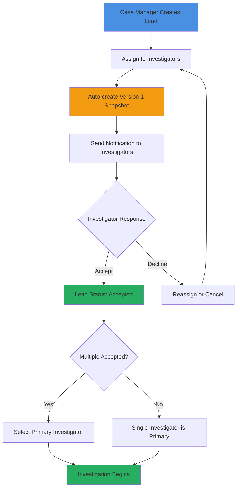

### 8.2 Lead Return Submission and Review Workflow

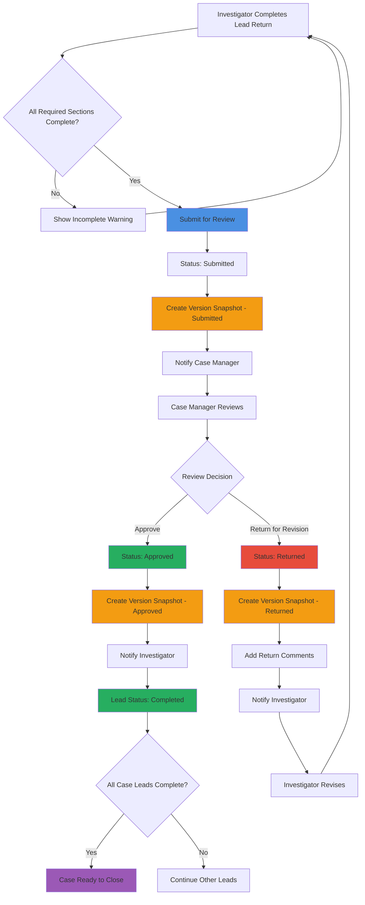

### 8.3 Version Control Workflow

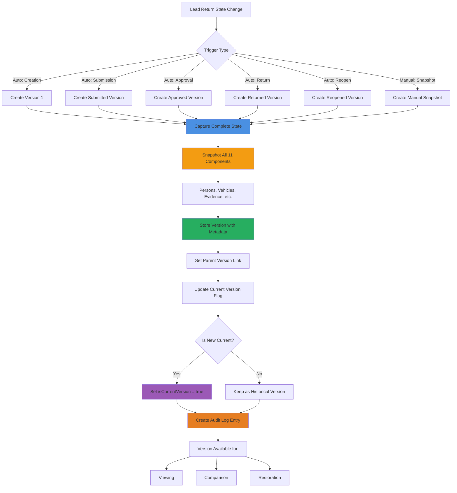

### 8.4 User Authentication Flow

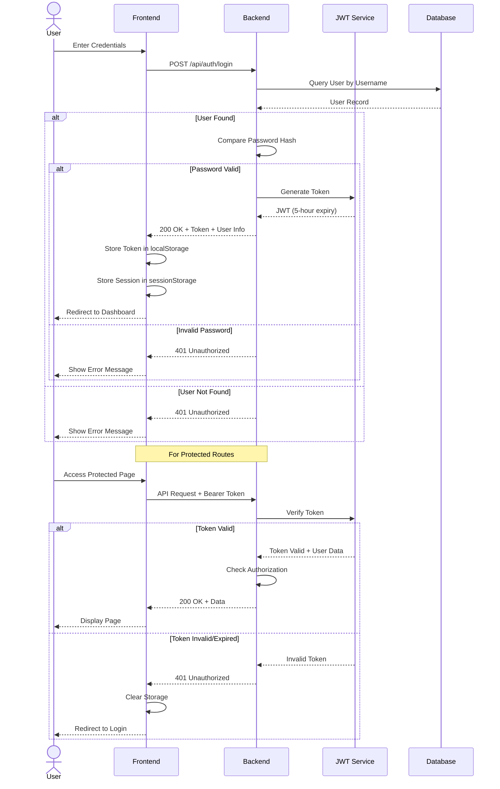

### 8.5 File Upload and Storage Flow

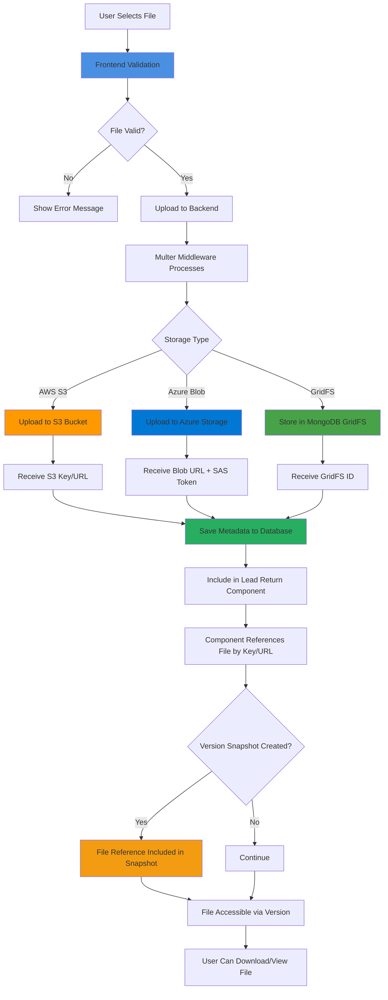

### 8.6 Case Closure Workflow

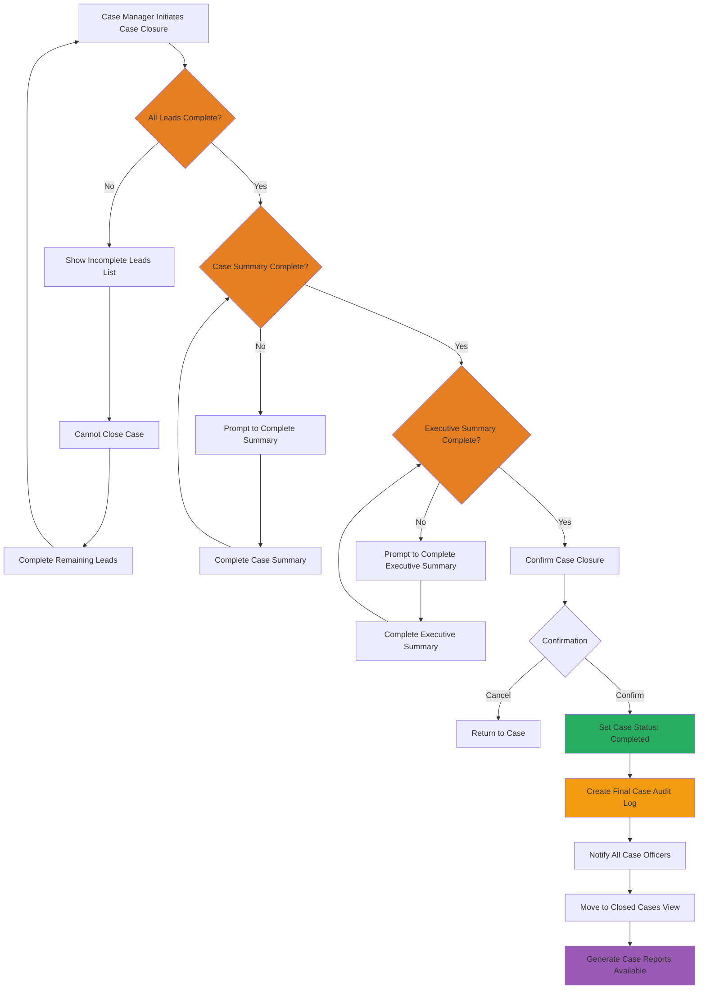

### 8.7 Audit Trail Creation Flow

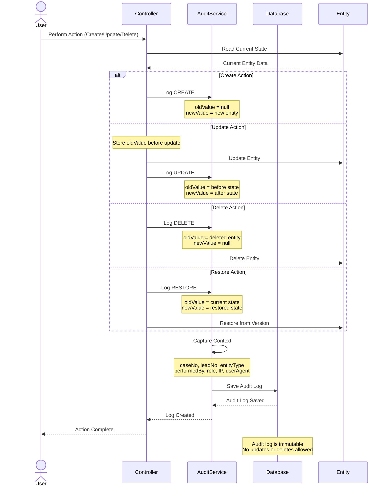

### 8.8 Notification System Flow

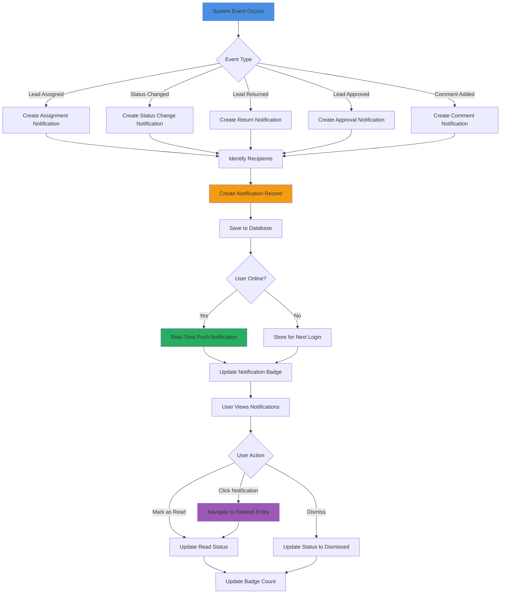

### 8.9 Access Control Enforcement

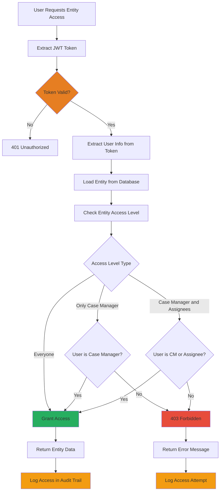

---

## 9. User Roles and Permissions

### 9.1 Role Definitions

| Role | Description | Primary Responsibilities |
|------|-------------|--------------------------|
| **Admin** | System administrator | User management, system configuration, all access |
| **Case Manager** | Investigation supervisor | Create cases/leads, assign investigators, review and approve lead returns, close cases |
| **Investigator** | Field investigator | Accept leads, document investigation findings, submit lead returns |
| **Detective Supervisor** | Supervisory role | Review cases and leads, provide oversight |

### 9.2 Permission Matrix

| Feature | Admin | Case Manager | Investigator | Detective Supervisor |
|---------|-------|--------------|--------------|---------------------|
| **User Management** |
| Create users | ✓ | ✗ | ✗ | ✗ |
| View users | ✓ | ✓ | ✗ | ✓ |
| **Case Management** |
| Create case | ✓ | ✓ | ✗ | ✗ |
| View case | ✓ | ✓ (assigned) | ✓ (assigned) | ✓ (assigned) |
| Update case | ✓ | ✓ (own) | ✗ | ✗ |
| Close case | ✓ | ✓ (own) | ✗ | ✗ |
| Assign officers | ✓ | ✓ (own) | ✗ | ✗ |
| **Lead Management** |
| Create lead | ✓ | ✓ | ✗ | ✗ |
| View lead | ✓ | ✓ (access control) | ✓ (assigned) | ✓ (access control) |
| Update lead | ✓ | ✓ (own) | ✗ | ✗ |
| Delete lead | ✓ | ✓ (own) | ✗ | ✗ |
| Assign lead | ✓ | ✓ (own) | ✗ | ✗ |
| Accept/Decline lead | ✗ | ✗ | ✓ (assigned) | ✗ |
| Reopen lead | ✓ | ✓ (own) | ✗ | ✗ |
| **Lead Return** |
| Create lead return | ✗ | ✗ | ✓ (assigned) | ✗ |
| Edit lead return | ✗ | ✗ | ✓ (assigned, before submission) | ✗ |
| Submit lead return | ✗ | ✗ | ✓ (assigned) | ✗ |
| Review lead return | ✓ | ✓ | ✗ | ✓ (read-only) |
| Approve lead return | ✓ | ✓ | ✗ | ✗ |
| Return for revision | ✓ | ✓ | ✗ | ✗ |
| View lead return | ✓ | ✓ (access control) | ✓ (assigned) | ✓ (access control) |
| **Versioning** |
| View version history | ✓ | ✓ (access control) | ✓ (assigned) | ✓ (access control) |
| Compare versions | ✓ | ✓ (access control) | ✓ (assigned) | ✓ (access control) |
| Create manual snapshot | ✓ | ✓ (own leads) | ✓ (assigned) | ✗ |
| Restore version | ✓ | ✓ (own leads) | ✓ (assigned, with approval) | ✗ |
| **Audit Logs** |
| View audit logs | ✓ | ✓ (own cases) | ✗ | ✓ (assigned cases) |
| Export audit logs | ✓ | ✓ (own cases) | ✗ | ✓ (assigned cases) |
| **Comments** |
| Add comment | ✓ | ✓ | ✓ | ✓ |
| Edit own comment | ✓ | ✓ | ✓ | ✓ |
| Delete own comment | ✓ | ✓ | ✓ | ✓ |
| Delete any comment | ✓ | ✓ (own cases) | ✗ | ✗ |
| **Reports** |
| Generate reports | ✓ | ✓ (own cases) | ✓ (assigned leads) | ✓ (assigned cases) |
| Chain of custody | ✓ | ✓ (own cases) | ✓ (assigned leads) | ✓ (assigned cases) |

### 9.3 Access Level Matrix

| Access Level | Admin | Case Manager (Assigned) | Investigator (Assigned) | Other Users |
|--------------|-------|------------------------|------------------------|-------------|
| **Everyone** | ✓ View/Edit | ✓ View/Edit | ✓ View/Edit | ✓ View |
| **Only Case Manager** | ✓ View/Edit | ✓ View/Edit | ✗ | ✗ |
| **Case Manager and Assignees** | ✓ View/Edit | ✓ View/Edit | ✓ View/Edit | ✗ |

---

## 10. Security Requirements

### 10.1 Authentication Security

#### Password Requirements
- Minimum 6 characters (recommend increasing to 8+)
- Hashed using bcryptjs with salt rounds ≥ 10
- No password stored in plain text
- Password reset functionality (future enhancement)

#### JWT Token Security
- Tokens signed with secret key (stored in environment variable)
- Token expiration: 5 hours
- Token includes: userId, username, role
- Tokens validated on every protected endpoint
- Invalid tokens result in 401 Unauthorized
- Client-side token expiry monitoring with 2-minute warning

#### Session Management
- Tokens stored in localStorage (consider httpOnly cookies for enhanced security)
- Session data in sessionStorage (cleared on browser close)
- Automatic logout on token expiration
- Emergency cleanup for corrupted session data

### 10.2 Authorization Security

#### Role-Based Access Control (RBAC)
- All protected endpoints verify role from JWT
- Role checked before allowing sensitive operations
- Principle of least privilege enforced
- Unauthorized access attempts logged

#### Entity-Level Access Control
- Access level enforced on all lead return components
- Three levels: Everyone, Only Case Manager, Case Manager and Assignees
- Server-side enforcement (never rely on client-side only)
- Access violations logged in audit trail

### 10.3 Data Security

#### Data Transmission
- HTTPS/TLS required for all communications in production
- CORS configured to allow only trusted domains
- No sensitive data in URL parameters
- Request/response validation

#### Data Storage
- Passwords hashed with bcryptjs
- Database encryption at rest (MongoDB/Cosmos DB encryption)
- Cloud storage with access control (S3 IAM, Azure SAS tokens)
- Sensitive data access logged

#### Input Validation
- Server-side validation for all inputs
- Sanitization to prevent injection attacks
- File upload validation (type, size, content)
- Rich text editor content sanitization

### 10.4 Protection Against Common Attacks

#### SQL/NoSQL Injection
- Mongoose schema validation
- Parameterized queries (no string concatenation)
- Input sanitization for special characters

#### Cross-Site Scripting (XSS)
- React's built-in XSS protection (JSX escaping)
- Rich text editor content sanitization
- Content Security Policy (CSP) headers recommended

#### Cross-Site Request Forgery (CSRF)
- CORS restrictions on API
- JWT token verification (not cookies, reduces CSRF risk)
- SameSite cookie attribute (if using cookies)

#### File Upload Security
- File type validation (whitelist approach)
- File size limits enforced
- Virus scanning recommended for production
- Files stored outside web root with access control
- Unique filenames to prevent overwriting

### 10.5 Audit and Compliance

#### Comprehensive Audit Trail
- All actions logged with timestamp
- User identification (userId, username, role)
- IP address and user agent captured
- Before/after snapshots for data changes
- Immutable audit logs (no edits or deletions)

#### Chain of Custody
- Complete evidence handling history
- Who, what, when, where for all evidence interactions
- Tamper-evident version snapshots
- Legal admissibility considerations

#### Data Retention
- Audit logs retained indefinitely (or per policy)
- Version snapshots retained permanently
- Soft delete for cases/leads (no permanent deletion)
- Backup and disaster recovery procedures

### 10.6 Security Best Practices

#### Environment Variables
- Sensitive credentials in .env file (never committed to Git)
- Different credentials for dev/staging/production
- Rotate secrets periodically
- Use managed secrets services (AWS Secrets Manager, Azure Key Vault)

#### Dependency Management
- Regular dependency updates (npm audit)
- Monitor for security vulnerabilities
- Use lock files (package-lock.json) for consistent installs
- Remove unused dependencies

#### Error Handling
- Generic error messages to users (no stack traces)
- Detailed errors logged server-side for debugging
- No exposure of system internals in error responses
- Rate limiting on authentication endpoints (prevent brute force)

---

## 11. Deployment Architecture

### 11.1 Production Deployment Diagram

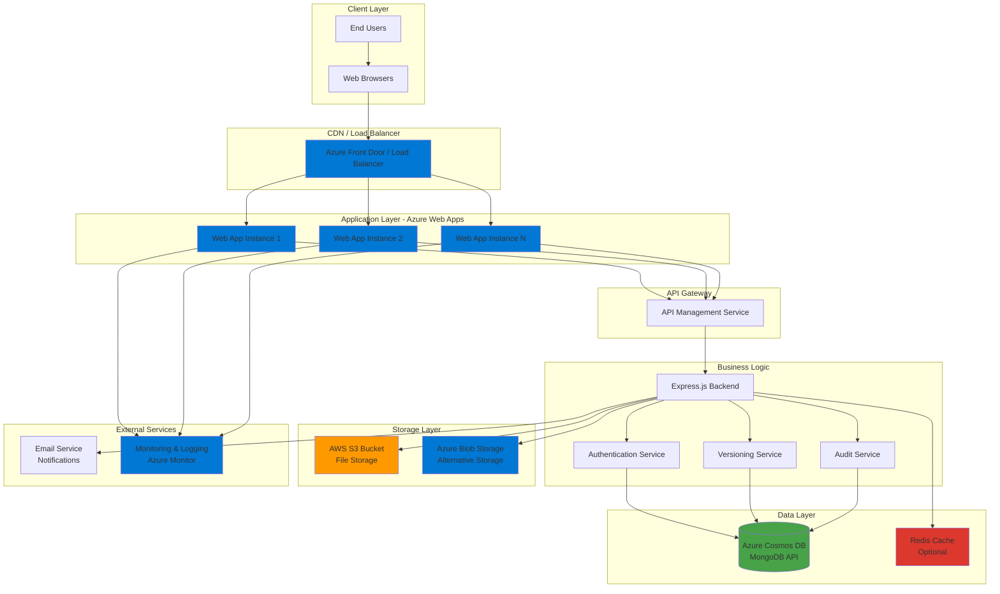

### 11.2 Deployment Components

#### Azure Web Apps
- **Instance Type**: Standard or Premium tier for production
- **Scaling**: Auto-scaling based on CPU/memory utilization
- **Deployment Slots**: Blue-green deployment for zero-downtime updates
- **Environment Variables**: Configured in App Service settings
- **Custom Domain**: pims-gqf3eyfxapgsa2fd.canadacentral-01.azurewebsites.net
- **SSL/TLS**: Managed certificates for HTTPS

#### Database - Azure Cosmos DB
- **API**: MongoDB API for compatibility
- **Consistency Level**: Session consistency (balance of performance and accuracy)
- **Backup**: Automatic backups with point-in-time restore
- **Geo-Replication**: Multi-region replication for disaster recovery (recommended)
- **Connection**: Connection string in environment variable (COSMOS_URI)

#### File Storage - AWS S3
- **Primary Storage**: AWS S3 bucket for files (images, audio, video, documents)
- **Access Control**: IAM policies and bucket policies
- **Encryption**: Server-side encryption (SSE-S3 or SSE-KMS)
- **Credentials**: AWS access key and secret in environment variables
- **Backup**: S3 versioning and lifecycle policies

#### Alternative Storage - Azure Blob Storage
- **Secondary Option**: Azure Blob Storage with SAS tokens
- **Container**: Dedicated container for PIMS files
- **Access Control**: SAS tokens for time-limited access
- **Redundancy**: LRS, GRS, or RA-GRS for durability

#### Caching - Redis (Optional)
- **Purpose**: Session storage, frequently accessed data caching
- **Provider**: Azure Cache for Redis or managed Redis service
- **Configuration**: ioredis package configured with connection string
- **TTL**: Time-to-live for cached items to ensure freshness

### 11.3 Deployment Pipeline

```mermaid
flowchart LR
    A[Developer] --> B[Git Push to Branch]
    B --> C{Branch Type}

    C -->|Feature Branch| D[CI: Build & Test]
    C -->|Main Branch| E[CI: Build, Test & Deploy]

    D --> F{Tests Pass?}
    F -->|No| G[Notify Developer]
    F -->|Yes| H[Create Pull Request]
    H --> I[Code Review]
    I --> J{Approved?}
    J -->|No| G
    J -->|Yes| K[Merge to Main]
    K --> E

    E --> L[Build Frontend]
    L --> M[Build Backend]
    M --> N[Run Tests]
    N --> O{All Pass?}

    O -->|No| G
    O -->|Yes| P[Deploy to Staging]
    P --> Q[Smoke Tests on Staging]
    Q --> R{Tests Pass?}

    R -->|No| G
    R -->|Yes| S{Manual Approval}
    S -->|Approve| T[Deploy to Production]
    S -->|Reject| G

    T --> U[Health Check]
    U --> V{Healthy?}
    V -->|No| W[Rollback]
    V -->|Yes| X[Deployment Complete]

    W --> G

    style A fill:#4a90e2
    style E fill:#f39c12
    style P fill:#e67e22
    style T fill:#27ae60
    style X fill:#27ae60
    style W fill:#e74c3c
```

### 11.4 Environment Configuration

#### Development Environment
```
NODE_ENV=development
PORT=5000
MONGO_URI=mongodb://localhost:27017/pims-dev
JWT_SECRET=dev-secret-key
AWS_REGION=us-east-1
BUCKET=pims-dev-bucket
CORS_ORIGIN=http://localhost:3000
```

#### Production Environment
```
NODE_ENV=production
PORT=80
COSMOS_URI=mongodb://[cosmos-account].mongo.cosmos.azure.com:10255/
JWT_SECRET=[secure-random-secret]
AWS_REGION=us-east-1
BUCKET=pims-prod-bucket
STORAGE_ACCOUNT_NAME=[azure-storage-account]
SAS_TOKEN=[secure-sas-token]
CORS_ORIGIN=https://pims-gqf3eyfxapgsa2fd.canadacentral-01.azurewebsites.net
```

### 11.5 Monitoring and Logging

#### Application Monitoring
- **Azure Application Insights**: Performance monitoring, error tracking
- **Metrics Tracked**: Response times, error rates, request counts
- **Custom Events**: Lead creation, submission, approval events
- **Alerts**: High error rate, slow response time, downtime

#### Log Management
- **Server Logs**: Console logs captured by Azure Web Apps
- **Application Logs**: Request/response logs, error logs
- **Audit Logs**: Stored in database, queryable via API
- **Log Retention**: 30 days for server logs, indefinite for audit logs

#### Health Checks
- **Endpoint**: /health or /api/health
- **Checks**: Database connectivity, file storage access, API availability
- **Frequency**: Every 1-2 minutes
- **Response**: 200 OK if healthy, 503 Service Unavailable if unhealthy

### 11.6 Disaster Recovery

#### Backup Strategy
- **Database Backups**: Automatic daily backups with 30-day retention
- **Point-in-Time Restore**: Restore to any point within retention period
- **File Storage Backups**: S3 versioning, cross-region replication (optional)
- **Configuration Backups**: Version control for deployment scripts and configs

#### Recovery Procedures
- **RTO (Recovery Time Objective)**: < 4 hours
- **RPO (Recovery Point Objective)**: < 1 hour (based on backup frequency)
- **Failover Plan**: Multi-region deployment for high availability (recommended)
- **Rollback Plan**: Azure deployment slots for quick rollback to previous version

---

## 12. Appendices

### Appendix A: Glossary

| Term | Definition |
|------|------------|
| **Case** | An investigation case that contains one or more leads |
| **Lead** | A specific investigation task within a case, assigned to investigators |
| **Lead Return** | The comprehensive documentation of investigation findings (11 sections) |
| **Version Snapshot** | A complete point-in-time capture of a lead return state |
| **Access Level** | Permission level controlling who can view/edit an entity |
| **Audit Log** | Immutable record of all system actions with before/after snapshots |
| **Chain of Custody** | Complete documented history of evidence handling |
| **Primary Investigator** | The main investigator responsible for a lead |
| **Case Manager** | Supervisor who creates cases/leads and approves lead returns |

### Appendix B: Database Indexes

#### Critical Indexes for Performance

**users collection:**
- `{ username: 1 }` (unique)
- `{ email: 1 }`

**cases collection:**
- `{ caseNo: 1 }` (unique)
- `{ "assignedOfficers.userId": 1 }`
- `{ caseStatus: 1 }`

**leads collection:**
- `{ leadNo: 1, caseNo: 1 }` (compound)
- `{ assignedTo: 1 }`
- `{ status: 1 }`
- `{ parentLeadNo: 1 }`

**completeleadreturns collection:**
- `{ leadNo: 1, versionId: 1 }` (compound unique)
- `{ leadNo: 1, isCurrentVersion: 1 }` (compound)
- `{ versionCreatedAt: -1 }`

**auditlogs collection:**
- `{ caseNo: 1, leadNo: 1 }`
- `{ entityType: 1, entityId: 1 }`
- `{ performedBy: 1, createdAt: -1 }`

**Lead Return Component Collections:**
- `{ leadNo: 1 }` on all (lrpersons, lrvehicles, etc.)
- `{ completeLeadReturnId: 1 }` on all

### Appendix C: File Size Limits

| File Type | Maximum Size | Notes |
|-----------|--------------|-------|
| Images | 10 MB | JPEG, PNG, GIF |
| Documents | 25 MB | PDF, DOCX, TXT |
| Audio | 50 MB | MP3, WAV, M4A |
| Video | 100 MB | MP4, AVI, MOV |

### Appendix D: Browser Compatibility Matrix

| Browser | Minimum Version | Notes |
|---------|-----------------|-------|
| Chrome | 90+ | Fully supported |
| Firefox | 88+ | Fully supported |
| Edge | 90+ | Fully supported (Chromium-based) |
| Safari | 14+ | Supported with minor limitations |
| IE 11 | Not Supported | Use Edge instead |

### Appendix E: Future Enhancements

#### Planned Features
1. **Two-Factor Authentication (2FA)**: Enhanced login security
2. **Advanced Search**: Full-text search with Elasticsearch
3. **Real-Time Collaboration**: WebSocket-based live updates
4. **Mobile App**: Native iOS/Android applications
5. **Email Integration**: Direct email import for enclosures
6. **Automated Report Scheduling**: Periodic report generation
7. **Data Export**: Bulk export to various formats (CSV, JSON, XML)
8. **Role Customization**: Custom roles with granular permissions
9. **Integration APIs**: Third-party system integration
10. **Machine Learning**: Automated evidence categorization and pattern detection

#### Performance Optimizations
- Database query optimization with aggregation pipelines
- CDN integration for static assets
- Image optimization and lazy loading
- Code splitting for faster initial page load
- Service workers for offline capability

---

## Document Control

| Version | Date | Author | Description |
|---------|------|--------|-------------|
| 1.0 | 2026-01-20 | Development Team | Initial SRD creation |

---

**End of Software Requirements Documentation**
